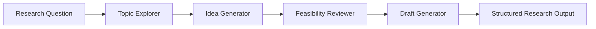

# math_mas

> An extensible multi-agent research workspace for turning open-ended questions into structured exploration, ideas, implementation checks, and research drafts.

<p align="center">
  <a href="https://github.com/2019012410/math_mas">
    
  </a>
  <a href="https://github.com/microsoft/autogen">
    
  </a>
  <a href="https://github.com/langchain-ai/langgraph">
    
  </a>
  
</p>

<p align="center">
  <strong>Research faster. Think in parallel. Iterate with agents.</strong>
</p>

## Why math_mas?

Research workflows are rarely linear. A useful answer may require literature exploration, competing ideas, feasibility analysis, implementation planning, and several rounds of refinement.

`math_mas` provides a lightweight foundation for coordinating specialized AI agents across these stages. It combines **AutoGen** for multi-agent collaboration with **LangGraph** for explicit workflow orchestration and state management.

## What it does

- **Explore** — investigate a topic and collect relevant background information.
- **Ideate** — generate and compare candidate research directions.
- **Validate** — review assumptions, constraints, and implementation feasibility.
- **Synthesize** — turn intermediate results into structured notes or research drafts.
- **Extend** — add custom agents, prompts, tools, models, and workflow nodes.

## Workflow



Each stage can be adapted or replaced for a specific research domain. The workflow is intended to support iteration rather than produce a one-shot answer.

## Core concepts

### Specialized agents

Give each agent a focused responsibility, such as literature exploration, hypothesis generation, code review, or technical writing. Focused roles make prompts easier to evaluate and workflows easier to debug.

### Explicit workflows

Use LangGraph to define nodes, transitions, shared state, and review loops instead of relying on an opaque chain of model calls.

### Tool and model flexibility

The architecture is designed to accommodate different model providers and external tools. Keep provider-specific configuration separate from agent and workflow logic.

### Structured outputs

Pass typed or schema-oriented results between stages whenever possible. This makes downstream processing more reliable and simplifies evaluation.

## Quick start

### Requirements

- Python 3.10 or newer
- An LLM provider or compatible local model runtime
- API credentials for the selected model provider, when required

### Install

```bash
git clone https://github.com/2019012410/math_mas.git
cd math_mas

python -m venv .venv

# macOS / Linux
source .venv/bin/activate

# Windows PowerShell
# .venv\\Scripts\\Activate.ps1

pip install -r requirements.txt
```

### Configure

Create a local `.env` file or export the environment variables required by your model provider:

```bash
export OPENAI_API_KEY="your-api-key"
```

Keep credentials out of source control. If an `.env.example` file is available, use it as the configuration template.

### Run

The repository is currently an evolving scaffold. Use the project entry point and examples provided by the implementation, and adapt the command below to the available runner:

```bash
python -m <your_entrypoint>
```

## Project layout

```text
.
├── README.md
├── requirements.txt
├── src/
│   ├── agents/       # Specialized agent roles
│   ├── workflows/    # LangGraph workflow definitions
│   ├── tools/        # External tools and integrations
│   ├── prompts/      # Reusable prompt templates
│   └── config/       # Runtime and model configuration
├── tests/             # Tests and evaluation cases
├── notebooks/         # Experiments and exploration
└── docs/              # Extended documentation
```

> The layout is a suggested organization for the evolving project. Keep the actual implementation and documentation synchronized as new modules are added.

## Example use cases

`math_mas` can serve as a starting point for:

- AI-assisted literature review
- Mathematical problem exploration
- Research idea generation
- Experiment and implementation planning
- Technical design review
- Structured report and draft generation
- Multi-agent workflow experimentation

## Development principles

- Keep agent responsibilities small and explicit.
- Prefer deterministic workflow transitions over implicit chaining.
- Validate model outputs before passing them to downstream agents.
- Add retries, timeouts, and error handling around external calls.
- Record intermediate state to make runs reproducible and debuggable.
- Never commit API keys, private data, or model credentials.

## Roadmap

- [ ] Add runnable end-to-end examples
- [ ] Provide provider-agnostic model configuration
- [ ] Add structured schemas for agent outputs
- [ ] Add workflow evaluation and regression tests
- [ ] Add observability for agent runs and token usage
- [ ] Expand documentation with practical research recipes

## Contributing

Contributions, ideas, and experiments are welcome.

1. Open an issue to discuss a larger change.
2. Fork the repository and create a focused branch.
3. Add tests or examples for behavior you change.
4. Keep prompts, workflows, and provider configuration modular.
5. Open a pull request with context, trade-offs, and validation steps.

## License

No open-source license has been declared for this repository yet. Until a license is added, please do not assume that the code may be redistributed or used commercially.

## Acknowledgements

This project builds on the ideas and tooling provided by:

- [AutoGen](https://github.com/microsoft/autogen)
- [LangGraph](https://github.com/langchain-ai/langgraph)

## Contact

For questions, suggestions, or collaboration, please open an issue in this repository.
